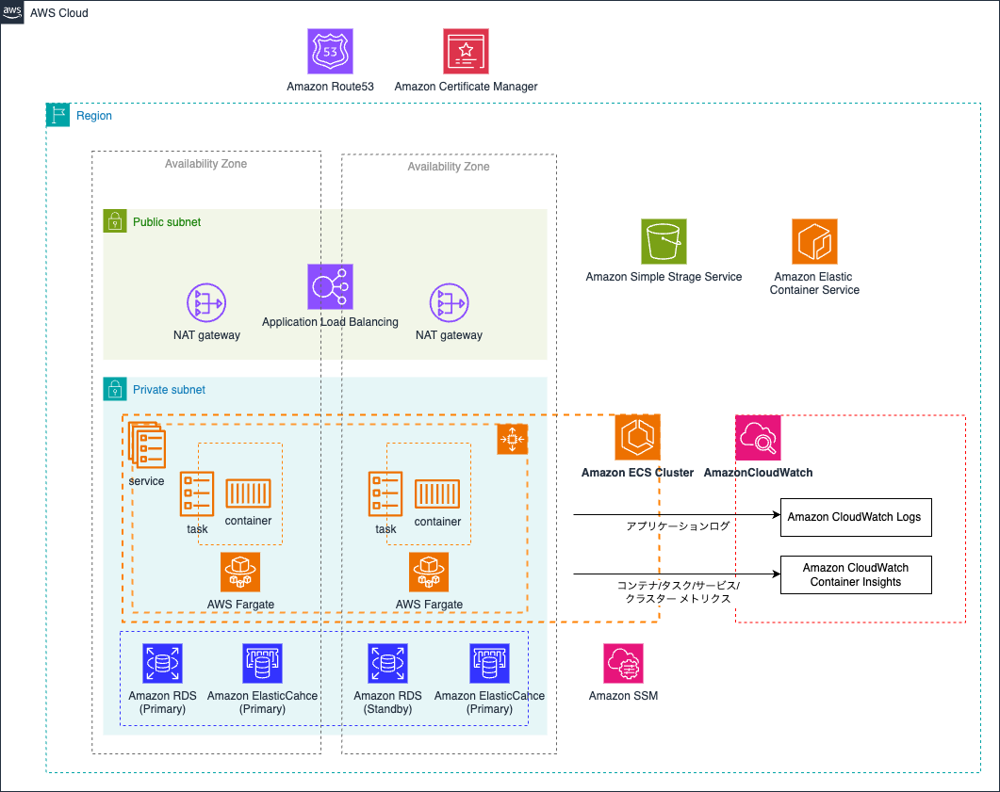

# Design

This document is intended to describe the decisions and assumptions that went into the current design of the ECS module(s). Various concepts of Amazon ECS are covered here to help align readers with the service and its capabilities and how they influence the design provided by this project.

  

